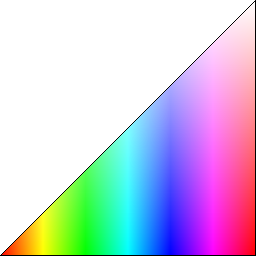

# GammaJ
| Tool | Description |
|---|:---:|
|  | A tool for changing gamma/contrast/brightness made in Java for Windows. JNA/WinAPI/JavaFX/Maven used. After first app run, a system restart is needed for windows registry to load enabled extended gamma ramp entry. |